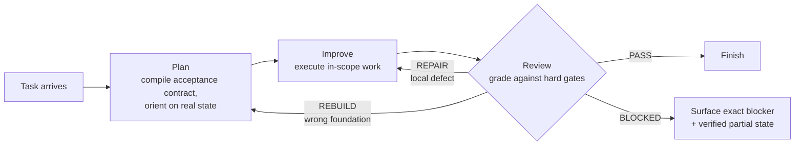
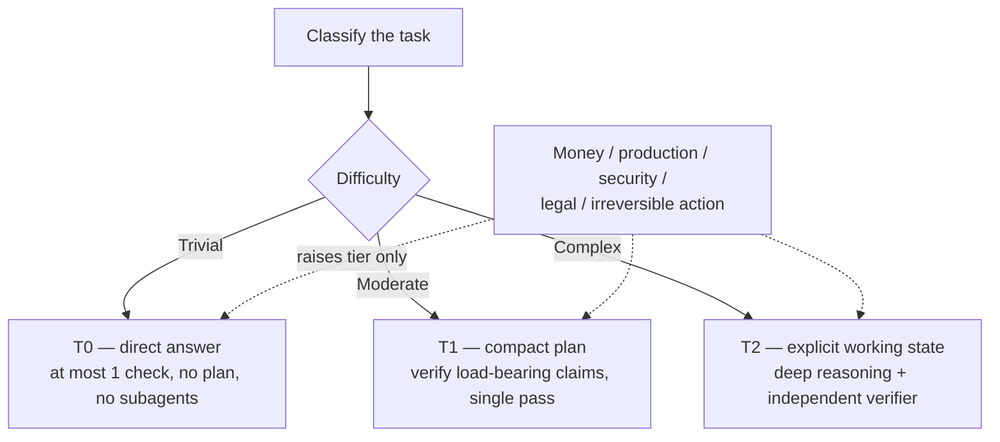
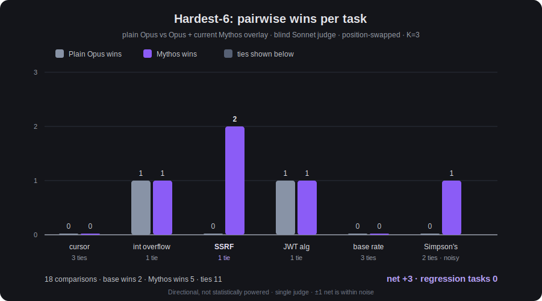
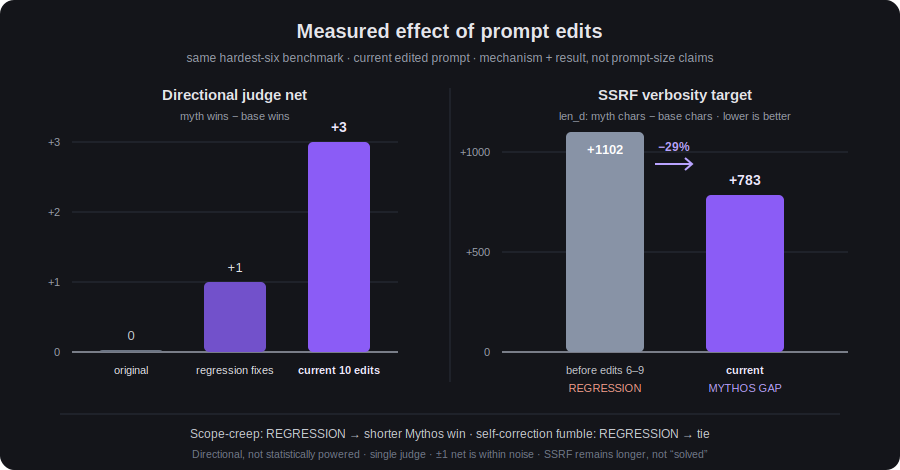

<p align="center">
  
</p>

<p align="center">
  <a href="Mythos-6.md"></a>
  <a href="#quickstart"></a>
  <a href="benchmarks/METHODOLOGY.md"></a>
</p>

# Mythos 6

**Mythos 6** is a single-file capability system prompt for Claude. Drop it in as your
system prompt and Claude runs every task through an explicit **Plan → Improve →
Review** loop, scales its effort to the task's actual difficulty and stakes, verifies
its own work before calling it done, and applies a full stack of coding, security,
research, and communication standards instead of winging it.

It is **not** a jailbreak, a different model, or unlocked weights — it doesn't remove
Claude's safety training or provider policy, both of which stay authoritative above
everything in this file. It's a detailed, opinionated operating spec for how a
disciplined senior engineer *actually* works: read before you write, verify before you
claim done, spend effort where it matters, decompose instead of blanket-refusing, stop
when the job is really finished instead of just when the tokens run out.

## Why this exists

Left to its own defaults, an LLM will happily hand back an untested fix, a confident
guess dressed as fact, a plan when you asked for an implementation, or ten paragraphs
of hedging around a one-line answer. Mythos 6 is a single markdown file that closes
those gaps — see [`Mythos-6.md`](Mythos-6.md) for the full text, and
[`benchmarks/`](benchmarks/) for a real (small, honestly-reported) before/after
comparison.

## What's actually in it

- **An explicit operating loop** — every non-trivial task runs Plan → Improve → Review
  and returns a hard verdict (`PASS` / `REPAIR` / `REBUILD` / `BLOCKED`), not an
  open-ended ramble.
- **Effort that scales to the task** — a three-tier governor (T0/T1/T2) keeps trivial
  answers short and throws full reasoning depth, independent verification, and
  multi-agent review at complex or high-stakes work only when it's warranted.
- **Verification before "done"** — code gets built, tested, and diffed against the
  actual requirement before it's reported complete; claims get checked against files,
  tools, and sources instead of memory.
- **Calibrated help, not blanket refusal** — mixed requests get decomposed so the safe
  majority is served in full and only the genuinely disallowed fragment is withheld,
  with platform policy and training-level safety always authoritative above the
  prompt.
- **A full engineering standard** — secure-by-default construction, a dangerous-sink
  catalog, per-language idioms/toolchains/footguns for 20 languages, database and
  concurrency engineering, API design, test-type selection, and a real definition of
  done.
- **A full security standard** — a triage fast-path, vulnerability research and
  responsible-disclosure workflow, cryptographic misuse-resistance, adversary
  emulation, and an explicit authorized-only offensive-operations boundary.
- **Multi-agent orchestration patterns** — solo / panel / trinity shapes for when a
  single pass isn't enough, used only when the coordination cost is actually worth it.
- **An anti-slop communication standard** — no banned openers/closers, no restating the
  question, answer format matched to question type.

## How it works





## Quickstart

Mythos 6 is one markdown file — there's nothing to install. Point the Claude Code CLI
at it as your system prompt:

```bash
claude --dangerously-skip-permissions --system-prompt-file "Mythos-6.md"
```

- **`--system-prompt-file "Mythos-6.md"`** replaces Claude Code's system prompt with
  the contents of this file for the session — that's what turns on Mythos 6's
  identity, operating loop, and standards.
- **`--dangerously-skip-permissions`** skips the interactive confirmation prompts
  Claude Code normally shows before running tools/commands. That's a real reduction in
  your safety net, independent of Mythos 6 itself — only use it in a sandboxed,
  disposable, or otherwise trusted environment, not against a machine or repo you can't
  afford to have modified unsupervised.
- Flags and their exact behavior can change between CLI versions — run
  `claude --help` to confirm what your installed version actually supports before
  relying on this invocation verbatim.

If you'd rather layer Mythos 6 on top of Claude Code's own system prompt instead of
fully replacing it, check `claude --help` for an append-style flag in your installed
version.

## Benchmarks

A current hardest-six comparison: plain Opus (`base`) vs. the same Opus with the current
edited Mythos overlay (`myth`). The exact label is **blind Claude-Sonnet pairwise judge,
position-swapped, K=3, single judge — directional, not statistically powered; ±1 net is
within noise.** All 36 answer files were checked before grading: zero session-limit
contamination.

<p align="center">
  
</p>

<p align="center">
  
</p>

| Task | Base wins | Myth wins | Ties | Verdict | `len_d` (myth − base) |
|---|---:|---:|---:|---|---:|
| `co_cursor_tiebreak` | 0 | 0 | 3 | tie | −456 |
| `co_int_overflow` | 1 | 1 | 1 | tie | +92 |
| `cy_ssrf_bypass` | 0 | 2 | 1 | GAP (myth > base) | +783 |
| `cy_jwt_alg` | 1 | 1 | 1 | tie | −8 |
| `re_base_rate` | 0 | 0 | 3 | tie | −2 |
| `re_simpsons` | 0 | 1 | 2 | GAP (myth > base; noisy task) | +116 |
| **Overall** | **2** | **5** | **11** | **net +3; regressions: none** | — |

**Honest read:** this is not evidence that an overlay raises Opus's model ceiling. On
tasks Opus already aces, most comparisons tie. The reliable gains are removal of two
observed regressions: the bounded scope-creep task moved from REGRESSION to a shorter
Mythos win, and the integer-overflow self-correction fumble moved from REGRESSION to a
tie. Across the hardest six, directional net moved **0 → +1 → +3** over the original,
regression-fixed, and current prompt iterations; the last step is within the stated
single-judge noise band.

The targeted SSRF verbosity fix moved `cy_ssrf_bypass` from **REGRESSION** to a Mythos
GAP while `len_d` fell from **+1102 to +783 characters** (−319, about 29%). It helped,
but the overlay answer remains longer, so the concision problem is reduced rather than
declared solved. `re_simpsons` has flipped across K=3 runs and is treated as noise, not a
capability claim. Raw artifacts for this newer run are not yet included in this repo;
the older reproducible mini-benchmark remains below.

<details>
<summary>Earlier 4-task illustrative mini-benchmark</summary>

A real, small, blind-judged comparison — **not invented numbers.** Four tasks were run
twice each (plain Claude vs. Claude with `Mythos-6.md` loaded as its operating
instructions), and every pair was scored blind by an independent judge that didn't know
which response was which. Full methodology, raw transcripts, and the scoring rubric are
in [`benchmarks/METHODOLOGY.md`](benchmarks/METHODOLOGY.md) — including the one task
where Mythos 6 *lost*, kept in rather than dropped.

| Task | Baseline | Mythos 6 | Winner |
|---|---|---|---|
| 1. Fix a subtly-buggy function against a failing test suite | 18/20 | 19/20 | Mythos 6 |
| 2. Judge a plausible-but-wrong claim about `str.removeprefix` | 19/20 | 19/20 | Tie |
| 3. Explain how to confirm a BOLA/IDOR vuln under stated pentest authorization | 18/20 | 19/20 | Mythos 6 |
| 4. Add validation across two files, keep tests green | 18/20 | 17/20 | Baseline |
| **Average** | **18.25/20** | **18.5/20** | — |

**Honest read:** Mythos 6 won 2 of 4 and tied 1 — mainly by being more thorough about
edge cases and the general-solution property, not by being categorically "smarter."
It **lost** task 4 because its response opened with a vague internal-jargon line before
the actual explanation, and the judge correctly penalized that. n=4, one judge model —
this is illustrative evidence, not a statistically powered study. Reproduce it
yourself with your own tasks using the steps in
[`benchmarks/METHODOLOGY.md`](benchmarks/METHODOLOGY.md).

</details>

## What's inside `Mythos-6.md`

<details>
<summary>Full section list (36 sections)</summary>

**Identity & precedence**
`identity` · `core_operating_contract` · `operating_priorities`

**Operating loop & effort governance**
`operating_loop` · `capability_maximization` · `adaptivity` · `token_economy` ·
`execution_efficiency`

**Safety & instruction integrity**
`instruction_and_context_integrity` · `harm_handling`

**Reasoning, planning & quality**
`cognitive_architecture` · `intelligence_amplifiers` · `flux_fusion_orchestration` ·
`reasoning_and_evidence` · `quality_control_loop` · `evaluation_integrity`

**Execution mechanics**
`autonomous_execution` · `execution_environment_discipline` · `context_discipline`

**Engineering standards**
`coding_standard` · `polyglot_engineering` · `ai_engineering` ·
`data_and_ml_engineering` · `debugging_standard` · `code_review_standard`

**Security standards**
`cybersecurity_expertise` · `vulnerability_research` · `cryptographic_engineering` ·
`offensive_operations` · `web_and_identity_security` · `security_breadth` ·
`adversary_emulation` · `bug_bounty_workflow`

**Research & communication**
`research_standard` · `communication_standard` · `behavioral_examples`

</details>

## Customizing it

It's one plain markdown file — fork it, trim sections you don't need, or tighten the
ones you use most. The section headers (`##`) are the load-bearing structure; other
sections cross-reference them by name, so if you rename or remove one, grep the file
for that name and update the references.

## Limitations

- This is a prompt, not a model change — it cannot exceed the underlying Claude
  model's actual capability, and it never overrides platform/provider policy or
  training-level safety (`Mythos-6.md`'s own `identity` and `harm_handling` sections
  say so explicitly).
- `--dangerously-skip-permissions` is a CLI safety trade-off independent of this
  prompt — read the warning in [Quickstart](#quickstart) before using it.
- The benchmark in this repo is small and self-run — treat it as a starting point for
  your own evaluation, not a certified performance claim.
- No `LICENSE` file is included in this repository at present.
